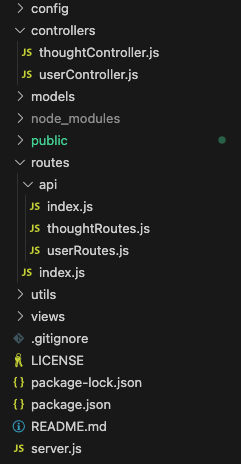
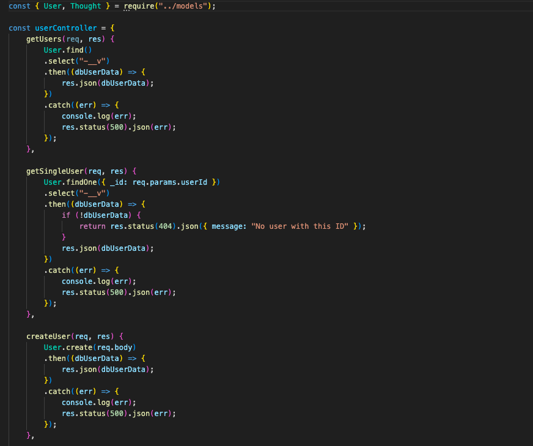
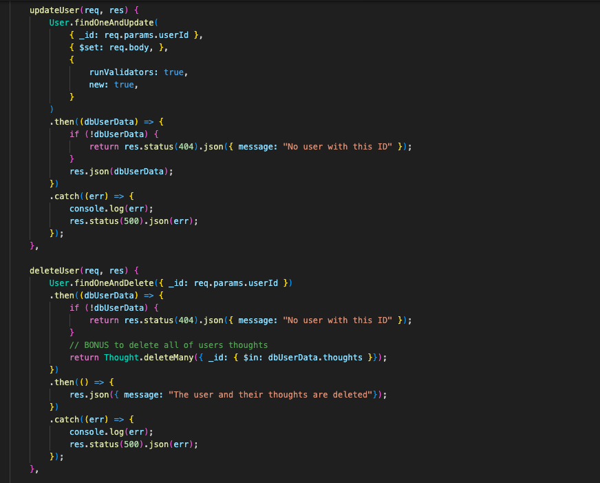
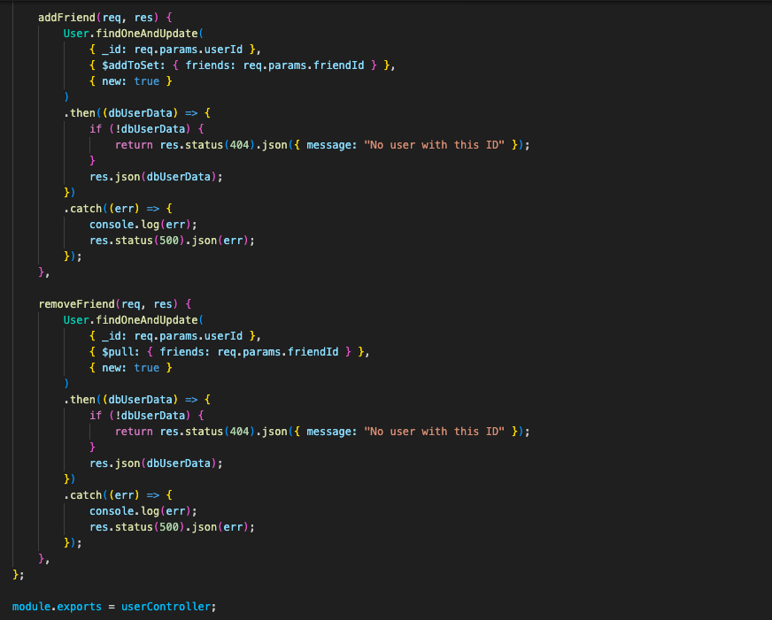
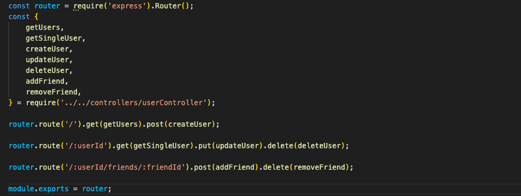
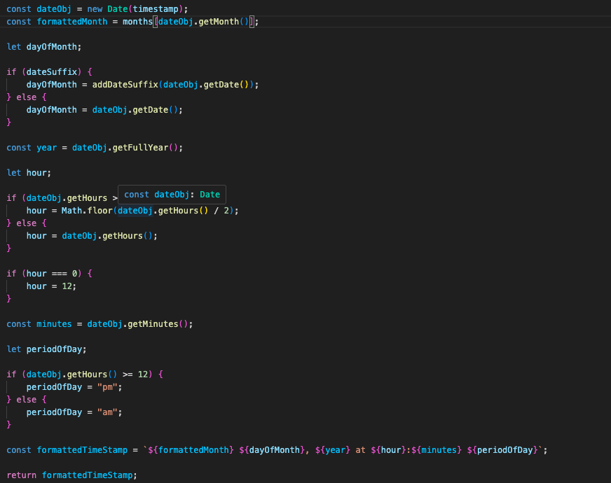
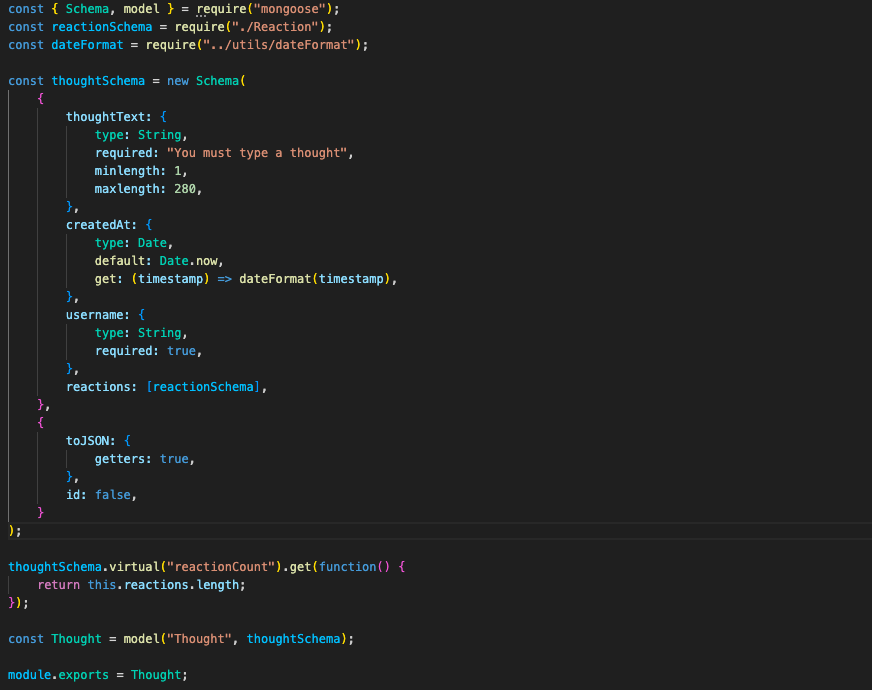

# (✿◠‿◠) SOCIAL NETWORK API (❛‿❛✿̶̥̥)

### [View Video Project Here](https://janets-tech-blog-a73a7af9497f.herokuapp.com/ "SOCIAL NETWORK API")<br />

| Technology Used    | Resource URL |
| --------  | ------- |
| NodeJS      | https://nodejs.org/en |
| ExpressJS      | https://expressjs.com/ |
| Nodemon  | https://www.npmjs.com/package/nodemon |
| Insomnia | https://insomnia.rest/ |
| MongoDB | https://www.mongodb.com/ |
| Mongoose | https://mongoosejs.com/docs/ |
| MongoDB Compass | https://www.mongodb.com/products/tools/compass |
| Screencastify | https://www.screencastify.com/ |
| JavaScript | https://developer.mozilla.org/en-US/docs/Web/JavaScript |
| Git       | https://git-scm.com/ |
| GitHub     | https://github.com/ |
| VSCode    | https://code.visualstudio.com/ |

## Table of Contents

* [Description](#description)
* [Installation](#installation)
* [Usage](#usage)
* [Credits](#credits)
* [License](#license)

## Description:
This project is a back end social media api. Using technology like MongoDB, Mongoose, and MongoDB Compass we are able to fully set up and test a backend for a social media platform.<br />
<br />

### How to use this app:

* Be sure to have the technologies above
* Download this repository to your local device
* Run `npm i && npm run seed`
* Run `npm start`
* Watch the video above on how to run routes in Insomnia
* View, add, update, and remove data as needed

  ## User Story

```md
AS A social media startup
I WANT an API for my social network that uses a NoSQL database
SO THAT my website can handle large amounts of unstructured data
```

## Acceptance Criteria

```md
GIVEN a social network API
WHEN I enter the command to invoke the application
THEN my server is started and the Mongoose models are synced to the MongoDB database
WHEN I open API GET routes in Insomnia for users and thoughts
THEN the data for each of these routes is displayed in a formatted JSON
WHEN I test API POST, PUT, and DELETE routes in Insomnia
THEN I am able to successfully create, update, and delete users and thoughts in my database
WHEN I test API POST and DELETE routes in Insomnia
THEN I am able to successfully create and delete reactions to thoughts and add and remove friends to a user’s friend list
```

### Lessons Learned

#### 1. MVC: MODELS
Thank GOODNESS for sequelize! Not that I don't like SQL, but using sequelize to model things out is beyond beneficial and so much easier to use and test. As you will see there is plenty of error-catching throughout my code to find potential issues. Highly recommend!
When it comes to models I learned how to connect tables together through what we deemed as the index file. Then from there we broke out a model file for each table of data, for example the BlogPost.
<br />



#### 2. MVC: VIEWS
Let's go Handlebars!! This part, although very confusing to get the hang of, I find to be super exciting. Modulating pages is a great way to scale projects quickly. With handlebars we are able to modulate our HTML so that it is easy to reuse throughout the application. For example we start with the main page for the layout, then we have several additional pages to handle different aspects of the application. We can also use partials to manage parts of an existing page. Examples shown are the main, dashboard, blogpost, and dashboardpost.
<br />





#### 3. MVC: CONTROLLERS(ROUTES)
The routes was by far the hardest part of this project for me. I'm still not sure I got it right, but the application is working. Controllers manage the navigate and data flow through out the application, which is why this is a full stack project. To begin with the index routes to all the other files and folders within the controllers, utilizing express router. A few more examples being the get all router for blog posts in the home routes, the login route for the users, and posting a new comment.
<br />



#### 4. Helpers
Helpers are helpful! Using the express handlebars we can implement helpers for the server to manage aspects like formatting the date. I'm sure there's a lot more that can be accomplished here, but I am still playing with the idea of what all can be done.
<br />



#### Synopsis
FROM SCRATCH! We had to build out every aspect of this project. Laying out all the files and rough draft took hours. Thankfully we could rely heavily on the in class assignments and code drills to sort out the needs overall. This challenge was extremely necessary to begin understanding the overall concept of MVC and how it can be applied to an application.

## Installation

1. Create a new repository on GitHub, to store this project.
2. Clone the repository to your computer.
3. Copy files to your own repository.
4. Follow the steps for "How to" above
5. Make changes to the code.
6. Commit the changes to the local repo.
7. Push the changes to the remote repo.

## Usage

This is a full stack tech blog project. If you would like to update and use app follow the installation steps and curate it to your needs. If you would like to use this app, follow the steps under the description 'How to' above and click the link at the top of this page.

## License

MIT License
Copyright (c) 2023 Twixmixy / Janet Webster

<hr />

## About The Author
### Janet Webster
Full Stack MERN Software Engineer in training.

- [GitHub](https://github.com/TwixmixyJanet/)
- [LinkedIn](https://www.linkedin.com/in/twixmixy/)
- [Twitter](https://twitter.com/Twixmixy)
- [WakaTime](https://wakatime.com/@Twixmixy)


<br /><br /><br /><br /><br /><br /><br /><br /><br /><br /><br /><br /><br /><br /><br /><br /><br /><br /><br /><br /><br /><br /><br /><br /><br /><br /><br /><br /><br /><br /><br /><br /><br /><br /><br /><br /><br /><br /><br /><br /><br /><br /><br /><br /><br /><br /><br /><br /><br /><br /><br /><br /><br /><br /><br /><br /><br /><br /><br /><br /><br /><br />

Did you really read down this far? Gold star for you! ⭐
```
You have received 5+ points in being EXTRA
```